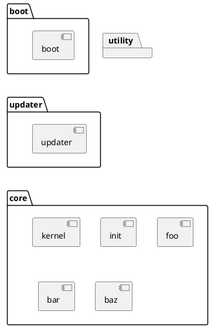
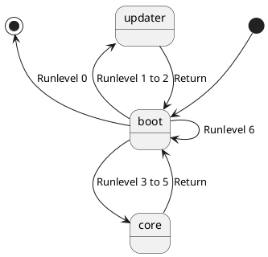

# Surfes 

Surfes is a simple, universal, reusable framework for embedded systems.

## High level architecture

### Package / Component

| Package | Purpose                             |
| ------- | ----------------------------------- |
| boot    | Statup the system                   |
| updater | Update components                   |
| core    | Provide main features of the system |
| utility | Utility modules for other packages  |

### State

#### Runlevel

A runlevel is a mode of operation, and it defines the state of the machine after boot.
Only one runlevel is executed on startup; run levels could be executed one after another.
Default runlevel is 3.

| ID  | Name           | Description                                              |
| --- | -------------- | -------------------------------------------------------- |
| 0   | Halt           | Shuts down the system, power-off if hardware supports it |
| 1   | Recovery mode  | Mode for downloading and recovering components           |
| 2   | Update mode    | Mode for updating components                             |
| 3   | User mode      | Starts the system normally                               |
| 4   | Developer mode | Same as runlevel 3 + x                                   |
| 5   | Reserved       | Currently unused                                         |
| 6   | Reboot         | Reboots the system                                       |
