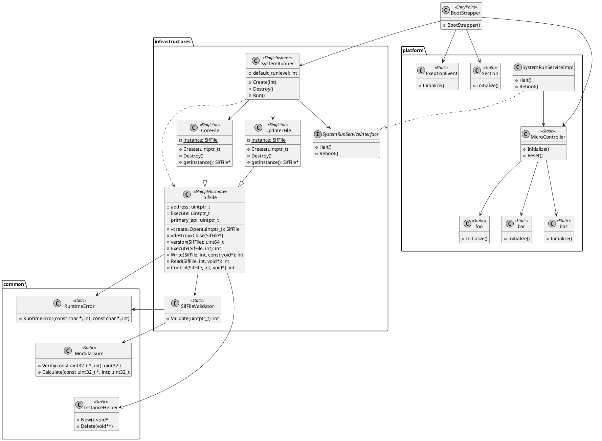

# Surfes Boot design doc

Boot is one of Surfes components and starts after power-on reset.

## Features

- On-chip memory diagnostics
  - Probably need to write assembly code to use registers instead of memory
- Minimum necessary hardware initialization
- System startup depending on the runlevel

## Module architecture

## Surfes Image Format

Surfes Image Format (SIF) is a proprietary format for binary image files.
By design, the SIF format is simple, flexible, extensible, and cross-platform.
Each SIF file is made up of one SIF header, followd by file data.

#### SIF File header

The SIF format supports both 32-bit addresses and 64-bit addresses.

| Offset      | Size(bytes) | Field                | Purpose                                                                                  |
| ----------- | ----------- | -------------------- | ---------------------------------------------------------------------------------------- |
| 0x00        | 16          | identification       | Provides machine-independent data with which to decode and interpret the file's contents |
| 0x10        | 2           | type                 | Identifies object file type                                                              |
| 0x12        | 2           | machine              | Specifies target instruction set architecture                                            |
| 0x14        | 4           | flags                | Interpretation of this field depends on the target architecture                          |
| 0x18        | 2           | header_size          | Contains the size of this header, normally 192 Bytes for 32-bit format                   |
| 0x1A        | 2           | primary_api_num      |                                                                                          |
| 0x1C        | 2           | extended_api_num     |                                                                                          |
| 0x1E        | 2           | reserved             | Currently unused                                                                         |
| 0x20        | 8           | file_version         | Identifies the version of file                                                           |
| 0x28        | 4           | file_size            | Contains the size of this file                                                           |
| 0x2C        | 4           | checksum             | The algorithm is modular sum                                                             |
| 0x30        | 4 / 8       | file_address         | The memory address to load this file                                                     |
| 0x34 / 0x38 | 4 / 8       | entry_point          | The memory address of the entry point from where the process starts executing            |
| 0x38 / 0x40 | 4 / 8       | primary_api_address  |                                                                                          |
| 0x3C / 0x48 | 4 / 8       | extended_api_address |                                                                                          |
| 0x40 / 0x50 | 128         | description          | Provides optional descriptions such as product name, product version, or copyright       |

##### identification

| Offset | Size(bytes) | Field        | Purpose                                                                                    |
| ------ | ----------- | ------------ | ------------------------------------------------------------------------------------------ |
| 0x00   | 4           | magic_number | `0x7F` followed by `SIF`(53 49 46) in ASCII; these four bytes constitute the magic number. |
| 0x04   | 1           | class        | This byte is set to `1` and it means 32-bit format.                                        |
| 0x05   | 1           | endianness   | This byte is set to either `1` or `2` to signify little or big endianness, respectively.   |
| 0x06   | 1           | version      | Set to `1` for the original and current version of SIF.                                    |
| 0x07   | 9           | reserved     | Currently unused.                                                                          |

##### file_type

| Value | Type               |
| ----- | ------------------ |
| 0x00  | No file type       |
| 0x01  | Data file          |
| 0x02  | Executable file    |
| 0x03  | Shared object file |

##### machine

| Value | Type                        |
| ----- | --------------------------- |
| 0x00  | No specific instruction set |
| 0x11  | Renesas RX                  |
